<div align="center">

# 🌴 PomologyAI
### Date Fruit Variety Classifier · Artificial Neural Network

[](https://pytorch.org)
[](https://gradio.app)
[](https://scikit-learn.org)
[](https://python.org)
[](https://huggingface.co/spaces/KARTHIKAKRISHNA123/PomologyAI)
[](LICENSE)

**A production-grade ANN inference pipeline that classifies date fruit varieties from 34 morphological and colour-statistical features — deployed as a zero-dependency web app on Hugging Face Spaces.**

</div>

---

## 📌 Problem Statement

Date fruit grading is traditionally a manual, labour-intensive agricultural process subject to human error and inconsistency. Automated morphological classification enables precision agriculture, improves supply-chain traceability, and reduces post-harvest losses.

**This system answers:** *Given 34 image-derived shape and colour features of a date fruit sample, which of the 7 commercial varieties does it belong to — and with what confidence?*

---

## 🎯 Solution Overview

PomologyAI wraps a trained PyTorch ANN inside a Gradio Blocks interface. Users adjust 34 sliders corresponding to morphological measurements (area, perimeter, eccentricity, RGB statistics, wavelet descriptors) and receive a real-time confidence distribution across 7 date varieties.

**No image upload required** — the system works on pre-extracted feature vectors, making inference instantaneous and compute-minimal.

---

## ✨ Key Features

| Feature | Detail |
|---|---|
| **7-class classifier** | BERHI, DEGLET, DOKOL, IRAQI, ROTAB, SAFAWI, SOGAY |
| **34 input features** | Shape geometry + RGB channel statistics + Daub4 wavelet descriptors |
| **Confidence scores** | Softmax probabilities for all 7 classes displayed as a ranked label |
| **Live inference** | Sub-100ms inference on CPU — no GPU required |
| **Dark amber UI** | Intentional palm-gold design language; grouped feature sections |
| **Production artifact** | Portable `.pth` weights + `scaler.pkl` + `label_encoder.pkl` |

---

## 🏗️ Overall Architecture

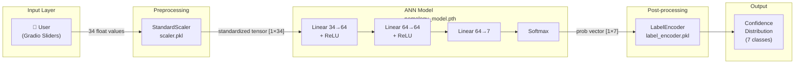

---

## 🧠 System Architecture

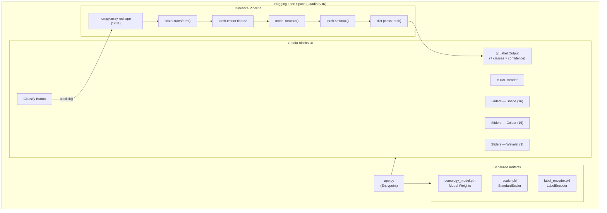

---

## 🧰 Technology Stack — Complete Breakdown

| Technology | Version | Category | Purpose in Project | Why Chosen | Key Features Used |
|---|---|---|---|---|---|
| **PyTorch** | 2.x | Deep Learning | ANN forward pass, weight serialization/loading | Dynamic computation graph, `state_dict` portability, `map_location='cpu'` for HF Spaces | `nn.Sequential`, `nn.Linear`, `nn.ReLU`, `model.eval()`, `torch.no_grad()`, `torch.softmax()`, `torch.save()`, `torch.load()` |
| **torch.nn** | — | Model API | Defines ANN architecture layers | Native PyTorch module; Sequential wrapping enables clean serialization | `nn.Module`, `nn.Sequential`, `nn.Linear`, `nn.ReLU` |
| **scikit-learn** | 1.x | Preprocessing | Feature standardization and label encoding | Industry-standard scalers; `joblib`-serializable for production reuse | `StandardScaler.fit_transform()`, `StandardScaler.transform()`, `LabelEncoder.fit_transform()`, `le.classes_` |
| **joblib** | — | Serialization | Persist `scaler.pkl` and `label_encoder.pkl` | Efficient numpy-array serialization, preferred over `pickle` for sklearn objects | `joblib.dump()`, `joblib.load()` |
| **NumPy** | 1.x | Numerical | Feature vector construction before tensor conversion | Bridge between Python list → sklearn scaler → PyTorch tensor | `np.array()`, `dtype=np.float32`, `.reshape(1, -1)` |
| **Gradio** | 4.x | UI / Serving | Auto-serves Gradio Blocks as HF Space web app | Native HF Spaces SDK; `gr.Blocks` enables custom layouts | `gr.Blocks`, `gr.Slider`, `gr.Label`, `gr.Button`, `gr.Row`, `gr.Column`, `gr.HTML`, `gr.Markdown`, `gr.themes.Base`, CSS injection |
| **Gradio Themes** | — | Design | Dark amber colour scheme via `.set()` token overrides | Subject-specific visual identity; avoids default grey | `gr.themes.Base`, `gr.themes.colors.amber`, `gr.themes.GoogleFont` |

---

## 🔄 Request Lifecycle

### Inference Request — User Submits Feature Vector

```
1. USER INTERACTION
   └── User adjusts 34 Gradio sliders → clicks "🔍 Classify Variety"
       → Gradio Blocks: btn.click(fn=predict, inputs=inputs, outputs=output)

2. PYTHON FUNCTION CALL
   └── predict(*feature_values) is invoked with 34 float arguments
       → args unpacked from slider components

3. PREPROCESSING
   └── np.array(feature_values, dtype=np.float32).reshape(1, -1)
       → shape: (1, 34)
       → scaler.transform(arr)  [StandardScaler loaded from scaler.pkl]
       → output shape: (1, 34) — zero-mean, unit-variance

4. TENSOR CONVERSION
   └── torch.tensor(arr_scaled, dtype=torch.float32)
       → shape: [1, 34]

5. FORWARD PASS
   └── model.eval() + torch.no_grad()
       → Linear(34→64) + ReLU
       → Linear(64→64) + ReLU
       → Linear(64→7)           [raw logits, shape: [1, 7]]

6. POSTPROCESSING
   └── torch.softmax(logits, dim=1).squeeze().numpy()
       → prob vector: [p0, p1, ..., p6], sum = 1.0
       → dict {CLASS_NAMES[i]: float(probs[i]) for i in range(7)}
       → CLASS_NAMES sourced from le.classes_ (LabelEncoder)

7. OUTPUT RENDER
   └── gr.Label displays top-3 confident classes with probability bars
       → Gradio auto-sorts by descending confidence
```

---

## 🌊 Data Flow Explanation

```
Training Data                              Inference Data
(DateFruit_Dataset.csv)                    (Gradio Sliders)
         │                                          │
         ▼                                          ▼
  DataFrame (X, y)                        feature_values: tuple[float]
         │                                          │
  StandardScaler.fit_transform(X_train)    np.array → reshape(1,34)
  LabelEncoder.fit_transform(y)                     │
         │                                  scaler.transform()
  joblib.dump(scaler)                               │
  joblib.dump(le)          ←──── reuse ────  standardized (1,34)
         │                                          │
  torch.tensor → TensorDataset                torch.tensor float32
         │                                          │
  DataLoader (batch=32)                      model.forward()   ← pomology_model.pth
         │                                          │
  ANN.forward() + CrossEntropyLoss           torch.softmax(dim=1)
         │                                          │
  Adam optimizer + 100 epochs               {class: probability}
         │                                          │
  torch.save(model.state_dict())             gr.Label renders output
```

---

<details>
<summary>📐 UML Diagram Suite — All 9 Diagrams</summary>

### 1. Use Case Diagram

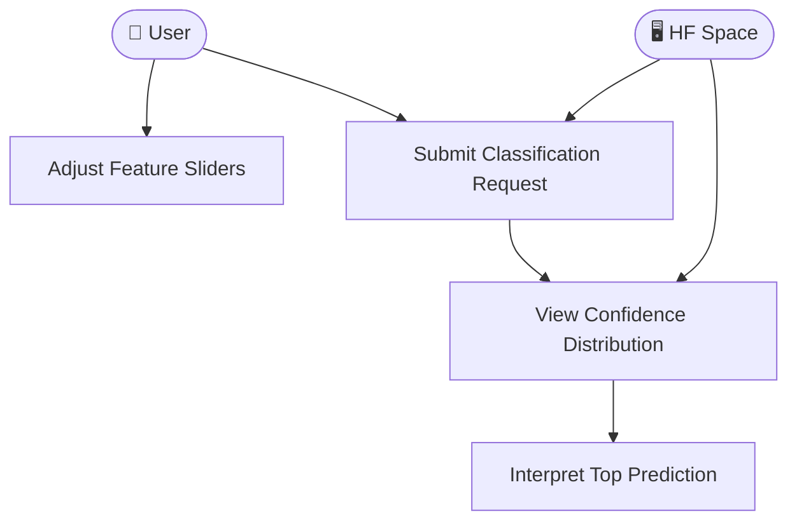

### 2. Class Diagram

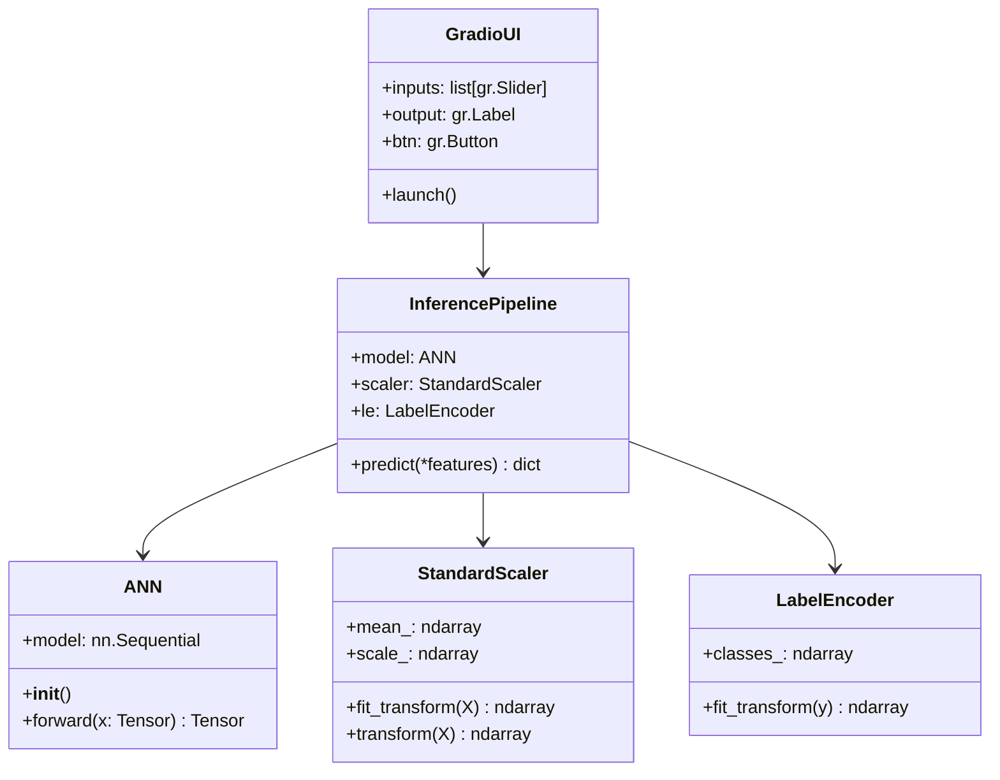

### 3. Sequence Diagram

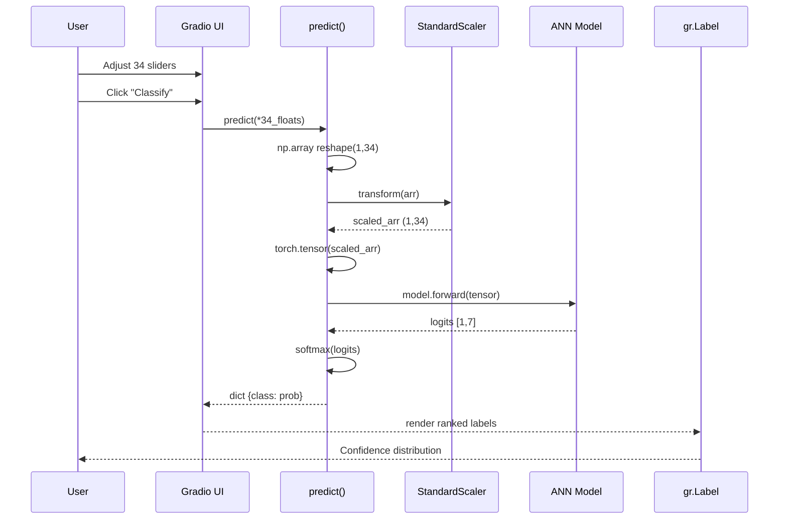

### 4. Activity Diagram

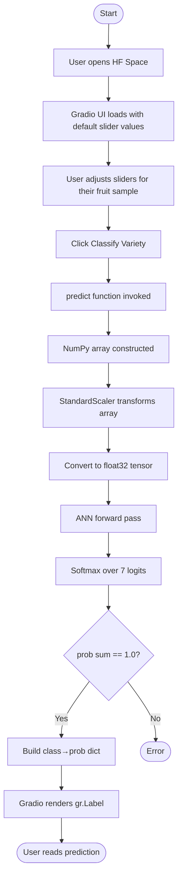

### 5. Component Diagram

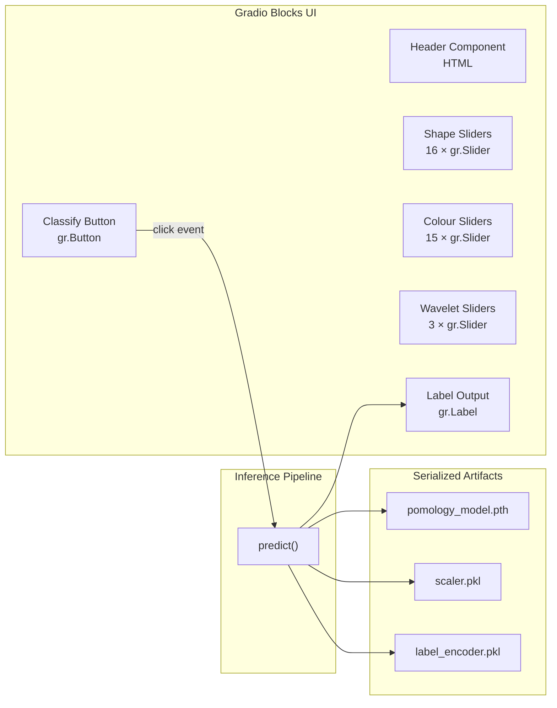

### 6. Deployment Diagram

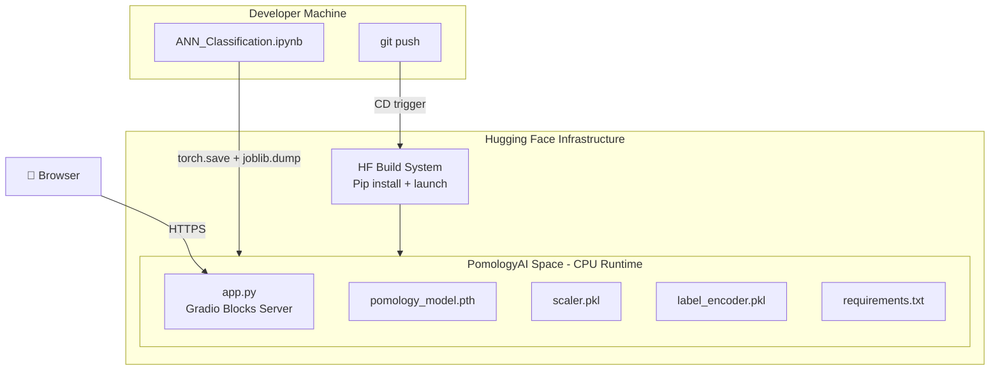

### 7. State Diagram

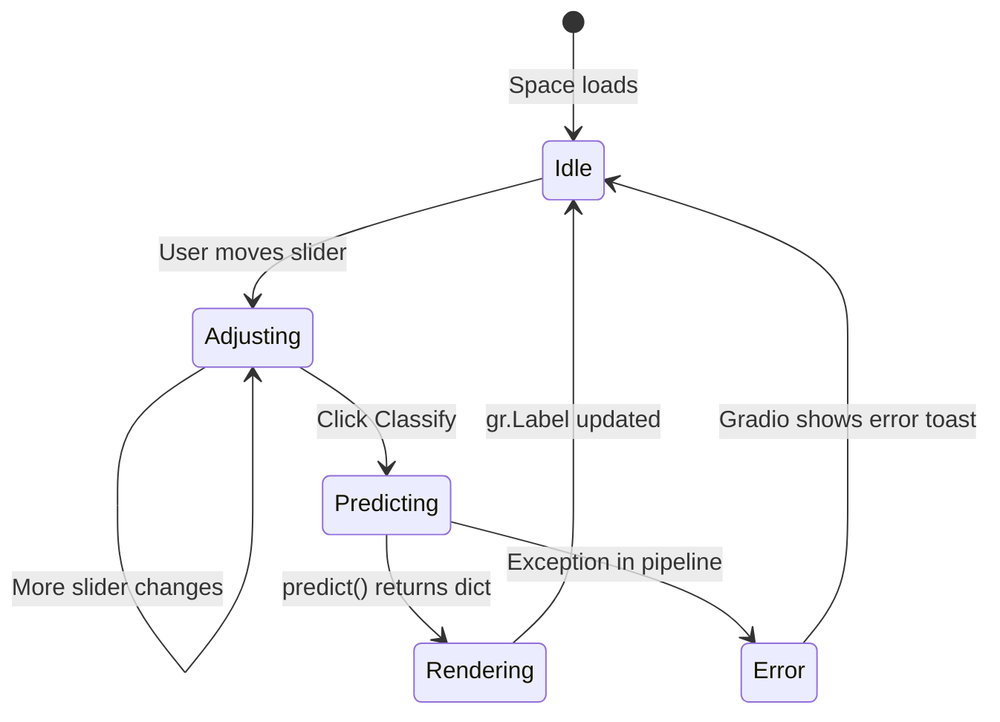

### 8. Object Diagram

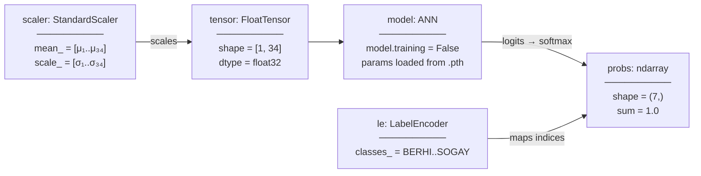

### 9. Package Diagram

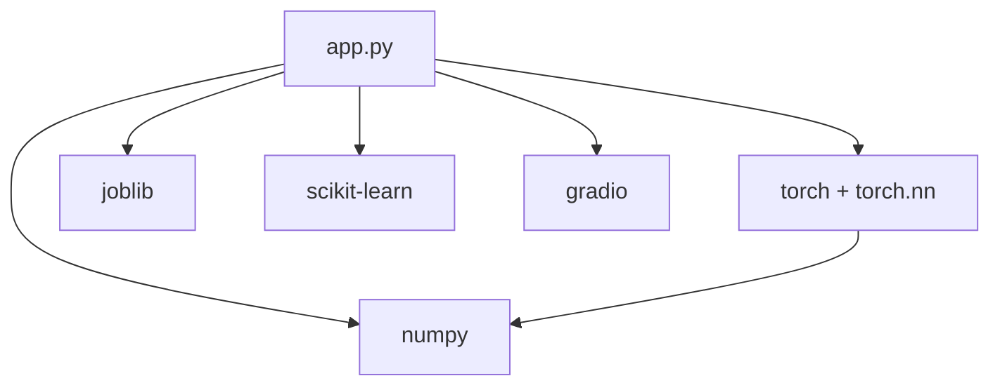

</details>

---

<details>
<summary>📊 Data Flow Diagrams — L0 and L1</summary>

### DFD Level 0 — Context Diagram

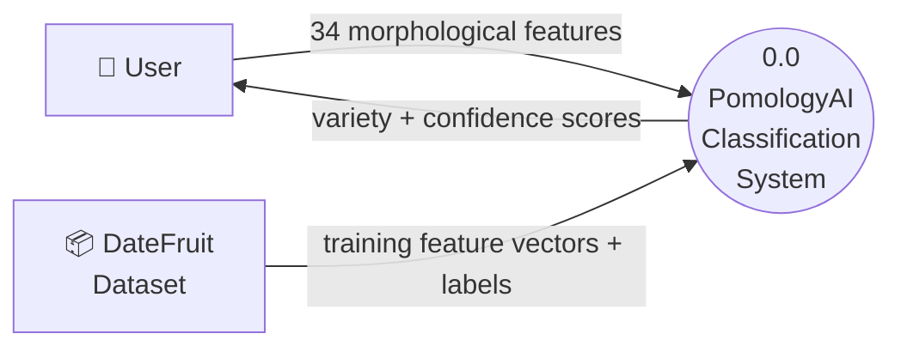

### DFD Level 1 — System Processes

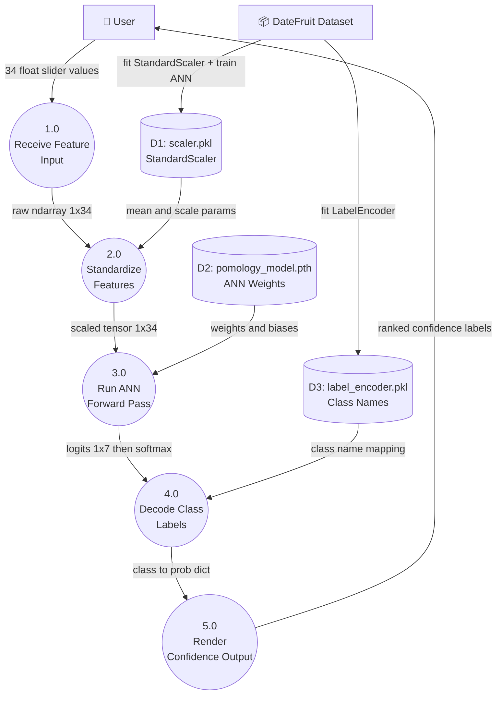

</details>

---

## 📁 Folder Structure

```
PomologyAI/                         ← HF Space root (cloned repo)
├── app.py                          ← Entrypoint: ANN class + predict() + Gradio UI
├── requirements.txt                ← Runtime dependencies
├── pomology_model.pth              ← Serialized ANN state_dict (trained weights)
├── scaler.pkl                      ← Fitted StandardScaler (joblib)
├── label_encoder.pkl               ← Fitted LabelEncoder — maps int→class name
└── README.md                       ← This file (HF Space card + documentation)
```

---

## ⚙️ Prerequisites

- Python 3.10+
- Git with [Git LFS](https://git-lfs.github.com/) (for `.pth` files > 10MB)
- Hugging Face account + `huggingface_hub` CLI

---

## 🚀 Local Installation

```bash
# 1. Clone the Space
git clone https://huggingface.co/spaces/KARTHIKAKRISHNA123/PomologyAI
cd PomologyAI

# 2. Install dependencies
pip install -r requirements.txt

# 3. Ensure artifacts are present
ls pomology_model.pth scaler.pkl label_encoder.pkl

# 4. Launch locally
python app.py
# → Opens at http://localhost:7860
```

---

## 🏋️ Training Artifacts — How to Export from Notebook

Run these cells **at the end** of `ANN_Classification.ipynb` before deploying:

```python
import torch, joblib

# Export model weights
torch.save(model.state_dict(), "pomology_model.pth")

# Export preprocessors
joblib.dump(scaler, "scaler.pkl")           # StandardScaler
joblib.dump(le, "label_encoder.pkl")        # LabelEncoder

print("Classes:", list(le.classes_))
print("✅ All artifacts exported")
```

Move all three files into the cloned HF Space directory before `git push`.

---

## 🧪 Inference Pipeline Internals

```python
# What predict() does step by step
arr        = np.array(feature_values, dtype=np.float32).reshape(1, -1)  # (1, 34)
arr_scaled = scaler.transform(arr)                                        # (1, 34) standardized
tensor     = torch.tensor(arr_scaled, dtype=torch.float32)               # FloatTensor [1, 34]

with torch.no_grad():
    logits = model(tensor)                       # [1, 7] raw scores
    probs  = torch.softmax(logits, dim=1)        # [1, 7] probabilities
    probs  = probs.squeeze().numpy()             # (7,) numpy

return {CLASS_NAMES[i]: float(probs[i]) for i in range(7)}
```

---

## 📦 Dependencies

```
torch          — ANN architecture, weight loading, tensor ops
numpy          — ndarray construction and reshaping
scikit-learn   — StandardScaler, LabelEncoder
joblib         — Artifact serialization and loading
gradio         — Blocks UI, sliders, label output, HF Spaces serving
```

---

## 🚀 Deployment

```bash
cd PomologyAI/

# Stage everything
git add app.py requirements.txt pomology_model.pth scaler.pkl label_encoder.pkl README.md

# Commit
git commit -m "feat: initialize PomologyAI inference engine"

# Push → triggers HF build pipeline
git push

# Monitor: HF dashboard shows Building → Running
```

> **Git LFS** — If `pomology_model.pth` exceeds 10MB, initialize LFS first:
> ```bash
> git lfs install
> git lfs track "*.pth" "*.pkl"
> git add .gitattributes
> ```

---

## 🔒 Security Considerations

- Model runs entirely on CPU inside HF Spaces — no GPU cost or attack surface
- All inputs are float sliders with `min/max` bounds — no raw string injection surface
- Artifacts are read-only at inference time; no user data is persisted

---

## ⚡ Performance

| Metric | Value |
|---|---|
| Inference latency | < 50ms on CPU |
| Model parameters | ~6,500 (34×64 + 64×64 + 64×7) |
| Memory footprint | < 1MB |
| Input features | 34 float32 values |
| Output | 7-class softmax distribution |

---

## 👩‍💻 Author

**Karthika Krishna M**  
B.E. Computer Science & Engineering  
Anna University Regional Campus, Tirunelveli  
Co-founder, Niranthara · AI/ML Engineer  

[](https://github.com/KARTHIKAKRISHNA123)
[](https://huggingface.co/KARTHIKAKRISHNA123)

---

## 📄 License

MIT License — see [LICENSE](LICENSE) for details.
